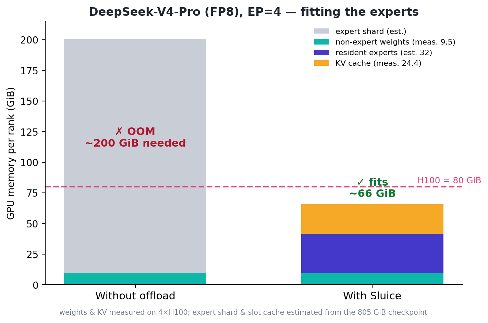

<p align="center">
  
</p>

<h1 align="center">Sluice</h1>

<p align="center"><b>Routing-aware MoE expert offloading for vLLM.</b></p>

<p align="center">
  Run Mixture-of-Experts models whose experts don't fit in VRAM — like
  <b>DeepSeek-V4</b> — by keeping the experts in host RAM and streaming only the
  router-selected ones into a small GPU cache each step. A vLLM
  <b>plugin</b>, not a fork.
</p>

<p align="center">
  <a href="#quickstart">Quickstart</a> ·
  <a href="#deploy-deepseek-v4">Deploy V4</a> ·
  <a href="#results">Results</a> ·
  <a href="docs/ARCHITECTURE.md">How it works</a>
</p>

---

## Why

In an MoE layer each token is routed to a few of many experts, but the kernel
needs every selected expert resident. The experts dominate the weight budget and
often exceed GPU memory — DeepSeek-V4 is ~805 GiB, still ~191 GiB per rank at
EP=4, far past an 80 GiB H100. vLLM's `--cpu-offload-gb` is static and
routing-blind. Sluice keeps experts in host RAM and pages the router's picks
into a small per-layer GPU cache, LRU-evicting the rest.

<p align="center"></p>

## Quickstart

```bash
pip install -e .          # into an environment that already has vLLM
SLUICE_SLOTS=16 python examples/run_dsv4_ep4.py
```

`SLUICE_SLOTS` is the number of resident experts per layer, per rank. Unset →
Sluice is completely inert and vLLM behaves normally.

## Results

Validated on 8×H100, via the pip plugin on **stock vLLM** (no fork, no patched
source).

- **Correctness** — DeepSeek-V2-Lite offloaded output is **bit-identical** to
  the resident baseline (greedy decode, token ids compared exactly).
- **Scale** — DeepSeek-V4-Pro (FP8, EP=4) loads with just **9.49 GiB** of GPU
  weights and generates coherently:
  > *The capital of France is* → **Paris. The capital of Germany is Berlin. The capital of Italy is Rome. The capital of Japan is Tokyo.**

<p align="center"></p>

## Deploy DeepSeek-V4

No fork needed: V4 model support is already upstream in vLLM; the offloading is
this plugin.

```bash
SLUICE_SLOTS=16 PYTORCH_CUDA_ALLOC_CONF=expandable_segments:True \
vllm serve deepseek-ai/DeepSeek-V4-Pro \
  --tensor-parallel-size 4 --enable-expert-parallel \
  --moe-backend marlin --kv-cache-dtype fp8 \
  --gpu-memory-utilization 0.45 --enforce-eager --max-model-len 512 --trust-remote-code
```

`marlin` honors `expert_map` (FlashInfer doesn't); `kv-cache-dtype fp8` is
required by V4; the low `gpu-memory-utilization` leaves VRAM for the slot caches,
which vLLM can't see when it sizes the KV cache. Offline example:
[`examples/run_dsv4_ep4.py`](examples/run_dsv4_ep4.py).

## Caveats

- Needs a backend that applies `expert_map` — **marlin** (NVFP4/FP8) or
  **triton** (unquantized). FlashInfer-style backends ignore it.
- Lower `gpu_memory_utilization` so the KV cache and slot caches both fit.
- Monkeypatches an internal vLLM factory and relies on the modular
  `quant_method.apply` signature — pin a known-good vLLM version.

See [docs/ARCHITECTURE.md](docs/ARCHITECTURE.md) for the design, the load/forward
paths, and the gotchas behind those caveats. Contributions welcome —
[CONTRIBUTING.md](CONTRIBUTING.md).

## License

Apache-2.0. Built on and for [vLLM](https://github.com/vllm-project/vllm). Icon
is original artwork.
