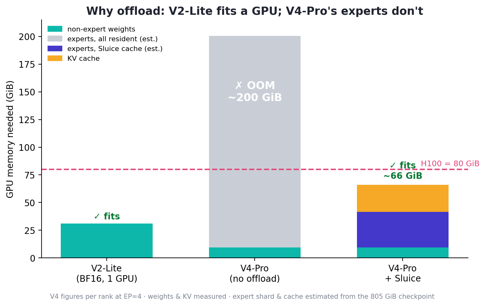
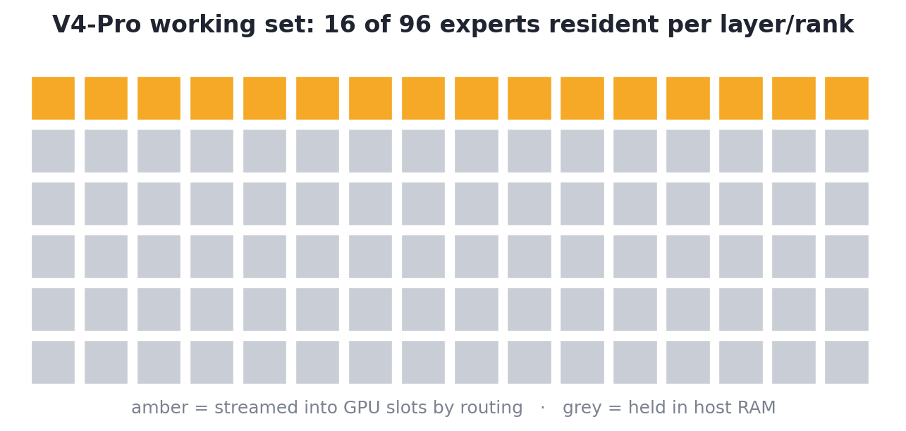

<p align="center">
  
</p>

<h1 align="center">Sluice</h1>

<p align="center">
  <b>Routing-aware MoE expert offloading for vLLM</b> — a plugin, not a fork.
</p>

<p align="center">
  Run Mixture-of-Experts models whose experts exceed GPU memory — like
  <b>DeepSeek-V4</b> — by keeping experts in host RAM and streaming only the
  router's picks into a small per-layer GPU cache each step.
</p>

<p align="center"></p>

## Quickstart

```bash
pip install -e .          # into an environment that already has vLLM
SLUICE_SLOTS=16 python examples/run_dsv4_ep4.py
```

`SLUICE_SLOTS` = resident experts per layer, per rank. Unset → Sluice is inert.

## Results

Stock vLLM, no fork. **V2-Lite** offloaded output is **bit-identical** to the
resident baseline (greedy, token ids). **V4-Pro** (FP8, EP=4) loads with just
**9.49 GiB** of GPU weights and answers correctly:

> *The capital of France is* → **Paris. The capital of Germany is Berlin. The capital of Italy is Rome. The capital of Japan is Tokyo.**

<p align="center"></p>

## Deploy DeepSeek-V4

```bash
SLUICE_SLOTS=16 vllm serve deepseek-ai/DeepSeek-V4-Pro \
  --tensor-parallel-size 4 --enable-expert-parallel \
  --moe-backend marlin --kv-cache-dtype fp8 \
  --gpu-memory-utilization 0.45 --enforce-eager --trust-remote-code
```

Needs an `expert_map`-honoring backend (`marlin` / `triton`, **not** FlashInfer);
the low `--gpu-memory-utilization` leaves VRAM for the slot caches. Design,
load/forward paths, and the gotchas: **[docs/ARCHITECTURE.md](docs/ARCHITECTURE.md)**.

---

<p align="center">
  Apache-2.0 · built on <a href="https://github.com/vllm-project/vllm">vLLM</a> ·
  <a href="docs/ARCHITECTURE.md">Architecture</a> ·
  <a href="CONTRIBUTING.md">Contributing</a>
</p>
