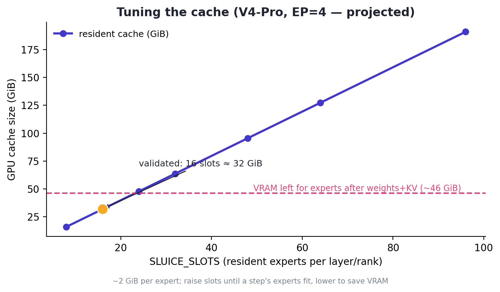

# Sluice architecture

This document explains how Sluice works, why it is built the way it is, and the
non-obvious problems that shaped the design. For usage see the
[README](../README.md).

## 1. The problem, precisely

A Mixture-of-Experts (MoE) layer routes each token to `top_k` of `N` experts.
The router picks the experts per token, but the fused-MoE kernel needs *every*
selected expert's weights resident on the GPU for that step. For large models
the experts dominate the weight budget:

- **DeepSeek-V4-Pro** (FP8): ~805 GiB of weights, almost all experts.
- Even with expert parallelism (EP) across 4 ranks, each rank's expert shard is
  far larger than an 80 GiB H100.

vLLM's built-in `--cpu-offload-gb` moves *whole tensors* to CPU at load time and
copies fixed tensors back every step — **static and routing-blind**. Nothing
follows the router. Sluice fills that gap.

## 2. Core idea: experts as a demand-paged cache

Treat the GPU as a small **cache of experts** and the router as the access
pattern — demand paging for experts:

```
        host RAM (all experts)                         GPU
   ┌───────────────────────────┐            ┌───────────────────────┐
   │ e0 e1 e2 e3 ... e_{N-1}    │            │  slot0  slot1  ... slotK│   (K << N)
   └───────────────────────────┘            └───────────────────────┘
                │   on_experts_selected(topk_ids)            ▲
                │   stream selected experts into free/LRU    │
                └────────────────────────────────────────────┘
   expert_map[global_id] -> slot   (so the unmodified kernel indexes the cache)
```

Each MoE layer keeps `K = SLUICE_SLOTS` resident experts instead of all `N`.
Each step, the experts the router selected are streamed into free/LRU slots and
`expert_map` is rewritten so the kernel reads the right rows. When
`K >= local_experts`, every expert gets a fixed slot (no eviction); below that,
it is an LRU working set.

## 3. Load path

vLLM builds the model, loads the checkpoint, runs per-layer weight processing,
then calls the offloader's `post_init`. Sluice hooks three points:

```
initialize_model ──► get_offloader().wrap_modules(...)        [1] park experts on CPU
       │
load_weights                                                   (checkpoint fills host)
       │
process_weights_after_loading(model, target_device)
   └─ for each module:
        with device_loading_context(module, target_device):   [2] stage layer -> GPU,
            quant_method.process_weights_after_loading(module)     repack, restore -> CPU
       │
gpu_model_runner: get_offloader().post_init()                  [3] install GPU slot cache
                                                                   + wrap quant_method.apply
```

1. **`wrap_modules`** — move each MoE layer's expert params to CPU so the
   checkpoint loads into host memory; record the layer.
2. **`device_loading_context`** (vLLM's own) — stages each layer's experts back
   to the GPU for `process_weights_after_loading` (e.g. the CUDA-only FP4/FP8
   marlin repack), then restores them to CPU. Only one layer is on the GPU at a
   time, so a shard far larger than GPU memory can be processed.
3. **`post_init`** — for each recorded layer: capture the processed (host-side)
   experts into a pinned CPU store, allocate a `[K, …]` GPU slot tensor per
   per-expert parameter, point `param.data` at it, install the `expert_map`
   buffer, and wrap `quant_method.apply`.

### Why `post_init`, not inside `process_weights` — the central bug

The natural place to install the GPU cache is inside the intercepted
`process_weights_after_loading`. That **silently fails**, and the failure mode
is subtle:

```python
# vLLM's device_loading_context (paraphrased)
for name, p in module.named_parameters():
    if p.device.type == "cpu":
        original_device[name] = p.device      # remembers "CPU"
        p.data = p.data.to(target_device)      # GPU for processing
try:
    yield                                      # our processing + slot install ran here
finally:
    for name, p in module.named_parameters():
        if name in original_device:
            p.data = p.data.to(original_device[name])   # ← moves our GPU slot back to CPU
```

Because `wrap_modules` parked the experts on CPU, the context records them as
"originally CPU" and **restores them to CPU on exit** — undoing any GPU cache we
installed inside `process_weights`. The first forward then hits a Triton kernel
with a CPU weight pointer:

```
ValueError: Pointer argument (at 1) cannot be accessed from Triton (cpu tensor?)
```

The fix is to install the cache in `post_init`, which `gpu_model_runner` calls
*after* `load_model` returns — i.e. after the context's restore. As a bonus, the
context already does the per-layer GPU staging for the repack, so Sluice does
**not** need to intercept `process_weights` at all.

## 4. Forward path

`post_init` wraps each layer's modular `quant_method.apply`. The modular MoE
path calls `apply(layer=…, topk_ids=…, …)`, so the wrapper has everything it
needs and fires `on_experts_selected` before the kernel:

```
router.select_experts ─► topk_ids
            │
quant_method.apply(layer, …, topk_ids)         ← wrapped by Sluice
            │  on_experts_selected(layer, topk_ids):
            │     • unique(topk_ids)
            │     • for each: ensure a GPU slot (stream from host if absent;
            │                 evict LRU slot when full)
            │     • expert_map[global] = slot   (-1 for non-resident)
            ▼
   fused-MoE kernel reads expert_map -> slot rows
```

`expert_map` is the existing global-expert-id → resident-row table the kernel
already consults; Sluice just keeps it and the slot contents in sync with
routing. On this vLLM, `layer.expert_map` is a property returning the
`_expert_map` buffer, and `expert_map_manager.update()` only runs on EP
reconfiguration (not per forward), so the per-step writes are safe.

## 5. Plugin integration — why no fork

Sluice changes **zero** vLLM source files. Two hooks:

1. **Offloader selection.** A `vllm.general_plugins` entry point runs
   `sluice.plugin.register()` in every engine/worker process at startup. When
   `SLUICE_SLOTS` is set it monkeypatches `create_offloader` (and the name as
   imported into `gpu_model_runner`) to return Sluice's offloader. vLLM then
   drives the standard `BaseOffloader` lifecycle on it.
2. **The routing hook.** Wrapping `quant_method.apply` in `post_init` avoids
   editing the MoE runner — the only change that would otherwise require a fork.

That is the whole integration surface: one patched factory function plus a
method wrapper, both installed through vLLM's own interfaces.

> Validated: `sluice -> sluice.plugin:register` is loaded in the worker process,
> and `Offloader set to ExpertStreamOffloader` confirms the active offloader on
> stock vLLM.

## 6. Backend requirement

The offloader works by rewriting `expert_map`, so the MoE backend **must apply
`expert_map`** and expose `topk_ids` to a modular `apply`:

- **TRITON** (unquantized) — applies `expert_map`. On Hopper/SM90 stock vLLM
  already prefers it over FlashInfer.
- **MARLIN** (NVFP4/FP8) — applies `expert_map`; select with
  `moe_backend="marlin"`.
- **FlashInfer-style / monolithic** backends route *inside* the kernel, ignore
  `expert_map`, and never expose `topk_ids` — they silently produce wrong output
  and are unsupported.

## 7. Memory model

- **Host RAM:** the full per-rank expert shard (processed form), pinned by
  default (`VLLM_WEIGHT_OFFLOADING_DISABLE_PIN_MEMORY=1` to disable).
- **GPU:** non-expert weights + `K` slots × per-expert size × layers + KV cache.
- **KV-cache caveat.** vLLM sizes the KV cache from the weight memory measured at
  load time, which excludes both the offloaded experts *and* Sluice's slot
  caches (installed in `post_init`, after the measurement). It therefore
  over-budgets KV and can OOM. Lower `gpu_memory_utilization` to leave room (e.g.
  0.45 for V4 on H100); `PYTORCH_CUDA_ALLOC_CONF=expandable_segments:True` helps.
  Measured V4 example: 9.49 GiB weights at load → 24.4 GiB KV at util 0.45.

## 8. Slot sizing

`SLUICE_SLOTS` must be ≥ the distinct experts a single step selects (per rank).
Decode selects few (≈ `top_k` per rank); a large prefill batch can select many,
so the startup profiling run may briefly overflow and log a warning — expected
and harmless (profiling output is discarded). If the warning appears during real
decode, raise the slot count.

The cache grows ~linearly with the slot count (≈ 2 GiB per expert for V4-Pro), so
the upper bound is whatever VRAM is left after weights and KV. Raise slots until a
step's experts fit; lower to reclaim VRAM.

<p align="center"></p>

## 9. Limitations & roadmap

- Monkeypatches an internal factory and relies on the modular
  `quant_method.apply(layer, …, topk_ids=…)` signature → pin a known-good vLLM.
- KV-budget hand-tuning (see §7); upstreaming offloader-aware profiling would
  remove it.
- No cross-layer prefetch yet — streaming is on the critical path. Prefetching
  next-layer experts behind compute is the main throughput lever.
- Upstreaming a generic `on_experts_selected` offloader hook would remove both
  the monkeypatch and the `apply` wrap.
